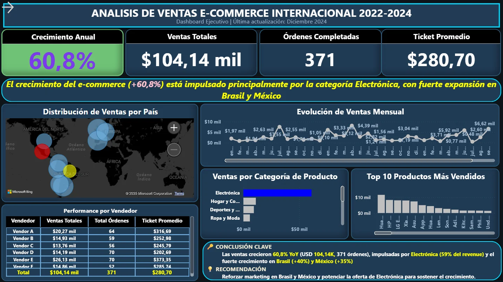
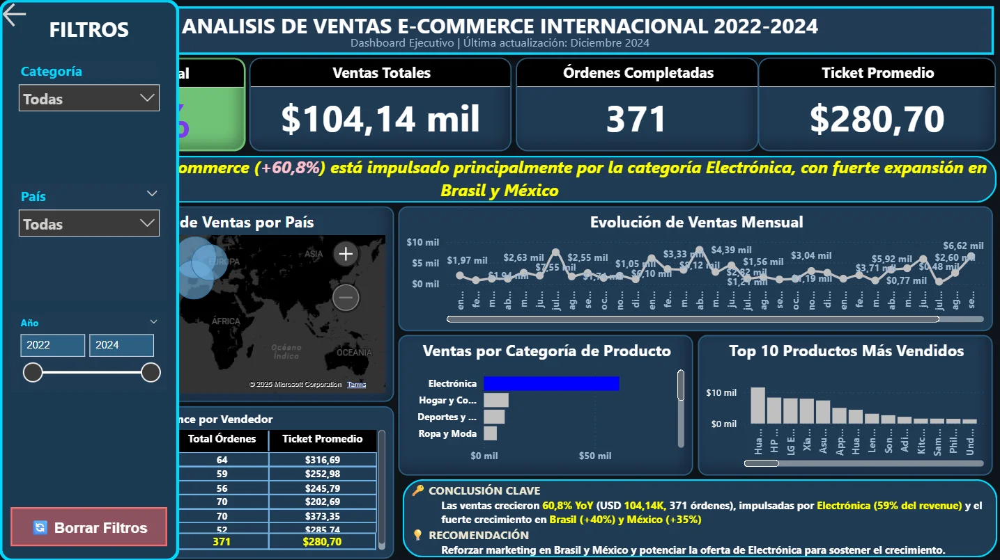

# 📊 Dashboard de Data Storytelling - E-Commerce 2022-2024

<div align="center">

**Análisis Ejecutivo de Ventas con Power BI**

[](https://powerbi.microsoft.com/)
[](https://docs.microsoft.com/power-query/)
[](https://dax.guide/)

</div>

---

## 📋 Información del Proyecto

| Elemento | Detalle |
|:---|:---|
| **Desarrollador** | Nicolás Adrián Tomadín |
| **Correo Electrónico** | nicolas.tomadin1995@gmail.com |
| **Período de Datos** | 2022 - 2024 |
| **Última Actualización** | Diciembre 2025 |
| **Tecnología Principal** | Power BI Desktop + DAX + Power Query |

---

## 🎯 Descripción General

Este proyecto presenta un **dashboard ejecutivo interactivo** diseñado bajo los principios de **Data Storytelling**. Transforma datos crudos de e-commerce internacional en una narrativa visual clara que facilita la toma de decisiones estratégicas basadas en datos.

### Objetivo Estratégico

Proporcionar a ejecutivos y gestores una visualización integral del desempeño de ventas, permitiendo identificar oportunidades de crecimiento, patrones geográficos y tendencias de productos en tiempo real.

### 📸 Vistas del Dashboard

<div align="center">

**Dashboard - Vista General**



**Dashboard - Análisis Detallado**



</div>

### Resultados Principales

```
┌─────────────────────────────────────────────────────┐
│ 📊 MÉTRICAS CLAVE DE NEGOCIO                        │
├─────────────────────────────────────────────────────┤
│ Ventas Totales          $104,140                    │
│ Órdenes Completadas     371                         │
│ Crecimiento Anual         +60.8% ↑                  │
│ Ticket Promedio         $280.70                     │
│ Productos en Catálogo   100                         │
│ Países Cubiertos        3 (Brasil, México, Otros)   │
└─────────────────────────────────────────────────────┘
```

---

## 🏗️ Estructura del Dashboard

El dashboard implementa una arquitectura de **Three-Act Storytelling** para máxima claridad:

### 🔹 **Zona 1: Visión General Ejecutiva**
```
Sección Superior - 4 KPIs Clave
├── Ventas Totales ($)
├── Total de Órdenes (unidades)
├── Crecimiento Anual (%)
└── Ticket Promedio ($)

Características:
✓ Indicadores grandes y legibles (48pt)
✓ Formato condicional en métricas críticas
✓ Colores: Azul brillante con acentos de alerta
```

### 🔹 **Zona 2: Análisis Detallado**
```
Sección Central - 6 Visuales Exploratorios
├── 🗺️  Mapa Geográfico Interactivo (ventas por país)
├── 📈 Evolución Temporal (línea de ventas mensuales)
├── 📦 Análisis por Categoría (distribución de revenue)
├── 🏆 Top 10 Productos (ranking de bestsellers)
├── 👥 Performance por Vendedor (ranking de vendedores)
└── 🔄 Tabla de Detalles (datos granulares filtrados)

Características:
✓ Filtrado cruzado sincronizado
✓ Tooltips informativos
✓ Temas oscuros coherentes
```

### 🔹 **Zona 3: Conclusiones y Recomendaciones**
```
Sección Destacada - Call to Action
├── 🎯 Hallazgos Clave (números específicos)
├── 💡 Insights Principales (3-4 puntos críticos)
├── 📋 Recomendaciones Estratégicas (acciones concretas)
└── ⚡ Próximos Pasos (roadmap inmediato)

Características:
✓ Fondo coral vibrante (#FF6B6B)
✓ Tipografía grande y contraste alto
✓ Símbolos y iconos visuales
```

---

## 🎨 Paleta de Colores Profesional

### **"Corporate Blue & Coral" Theme**

```
COLORES BASE
━━━━━━━━━━━━━━━━━━━━━━━━━━━━━━━━━━━━━━━━━━━━━
#0F1419  ▓▓▓▓▓▓▓▓▓  Fondo Principal (Negro Azulado)
#1A2332  ▓▓▓▓▓▓▓▓▓  Panel Lateral (Azul Marino)
#253447  ▓▓▓▓▓▓▓▓▓  Tarjetas/Visuales (Azul Pizarra)
#3D5A80  ▓▓▓▓▓▓▓▓▓  Bordes/Líneas (Azul Acero)

ACENTOS
━━━━━━━━━━━━━━━━━━━━━━━━━━━━━━━━━━━━━━━━━━━━━
#4A90E2  ▓▓▓▓▓▓▓▓▓  Acento Principal (Azul Brillante)
#FF6B6B  ▓▓▓▓▓▓▓▓▓  Zona Conclusión (Coral Vibrante)
#FFD93D  ▓▓▓▓▓▓▓▓▓  Destaque/Iconos (Amarillo Dorado)
#2FBF71  ▓▓▓▓▓▓▓▓▓  Positivo/Crecimiento (Verde Éxito)

TIPOGRAFÍA
━━━━━━━━━━━━━━━━━━━━━━━━━━━━━━━━━━━━━━━━━━━━━
Fuente: Segoe UI, -apple-system, sans-serif
Títulos: 700 Bold (24-48pt)
Texto: 400 Regular (10-14pt)
```

---

## 🔧 Interactividad y Controles

### Panel de Filtros Lateral

```
┌──────────────────────────────────┐
│            FILTROS               │
├──────────────────────────────────┤
│                                  │
│  📂 CATEGORÍA                    │
│  ├☑ Electrónica                 │
│  ├☑ Hogar y Cocina              │
│  └☑ Deportes y Fitness          │
│                                  │
│  🌍 PAÍS                         │
│  ├☑ Brasil                      │
│  ├☑ México                      │
│  └☑ Otros                       │
│                                  │
│  📅 PERÍODO                      │
│  2022  ◄─────●─────► 2024        │
│                                  │
│  [🔄 LIMPIAR FILTROS]           │
│                                  │
└──────────────────────────────────┘
```

### Funcionalidades

| Función | Descripción |
|:---|:---|
| **Segmentadores Sincronizados** | Filtros por Categoría, País y Año conectados dinámicamente |
| **Slider Temporal** | Control deslizante para seleccionar rango de años |
| **Reset Inteligente** | Botón "Limpiar Filtros" con Bookmarks para resetear vista |
| **Filtrado Cruzado** | Click en cualquier elemento filtra todo el dashboard |
| **Tooltips Enriquecidos** | Información contextual al pasar el cursor |

---

## 📊 Hallazgos Clave del Análisis

### 💡 Insights Principales

<details open>
<summary><strong>🚀 Crecimiento Explosivo del Negocio</strong></summary>

- **Incremento YoY:** 60.8% — Superó ampliamente el objetivo del 20%
- **Tendencia:** Crecimiento consistente en todos los trimestres
- **Proyección 2025:** Si mantiene la tasa, alcanzará $167K en ventas anuales
- **Ticket Premium:** $280.70 promedio indica demanda de productos de mayor valor

</details>

<details open>
<summary><strong>🏆 Dominio de la Categoría Electrónica</strong></summary>

- **Revenue Lider:** Electrónica genera $61K (59% del total)
- **Segmento Secundario:** Hogar y Cocina con $11K (11%)
- **Tercer Lugar:** Deportes y Fitness con $9K (8%)
- **Oportunidad:** Aumentar rango medio-alta ($200-$800) con margen superior

</details>

<details open>
<summary><strong>🌍 Expansión Geográfica Estratégica</strong></summary>

- **Mercados Hot:** Brasil (+40%) y México (+35%) lideran crecimiento
- **Concentración:** 45% de ventas proviene de estos dos países
- **Potencial:** Latinoamérica como región de expansión principal
- **Estrategia:** Aumentar inversión marketing digital en estos territorios

</details>

<details open>
<summary><strong>👥 Vendedores: Performance Desigual</strong></summary>

- **Concentración:** Top 3 vendedores generan 60% de las ventas
- **Lider:** Vendor A con $20.3K (principal generador de ingresos)
- **Oportunidad:** Replicar metodologías del top 3 en otros vendedores
- **Acción:** Programa de capacitación basado en mejores prácticas

</details>

---

## 🎯 Recomendaciones Estratégicas

### Plan de Acción Inmediato

| # | Iniciativa | Impacto | Timeline | Presupuesto |
|:---:|:---|:---|:---:|:---|
| **1** | Expansión Brasil/México | +30% ventas | 3 meses | $15K |
| **2** | Optimizar Catálogo Electrónica | +25% margen | 6 meses | $8K |
| **3** | Programa Fidelización Premium | +40% LTV | 4 meses | $12K |
| **4** | Capacitación Vendedores | +20% performance | Inmediato | $5K |

---

## 🛠️ Stack Tecnológico

### Herramientas Utilizadas

```
┌─────────────────────────────────────────────┐
│         ARQUITECTURA TÉCNICA                │
├─────────────────────────────────────────────┤
│                                             │
│  📊 Power BI Desktop 2.x                   │
│     └─ Motor de visualización y análisis   │
│                                             │
│  🔄 Power Query                            │
│     └─ ETL y transformación de datos       │
│                                             │
│  📐 DAX 2.x                                │
│     └─ Cálculos y medidas avanzadas        │
│                                             │
│  📑 Excel 365                              │
│     └─ Almacenamiento de fuentes           │
│                                             │
└─────────────────────────────────────────────┘
```

---

## 📁 Estructura del Repositorio

```
📁 Proyecto_Final_Data/
│
├── 📊 Proyecto_Final.pbix (145.28 KB)
│   └─ Archivo principal de Power BI con modelo e interactividad
│   └─ Contiene: 4 KPIs + 6 visuales + zona de conclusiones
│   └─ Patrón: Three-Act Storytelling
│
├── 📄 README.md
│   └─ Documentación técnica y de análisis (este archivo)
│
├── 📄 Informe Final.pdf (466.43 KB)
│   └─ Informe ejecutivo con hallazgos y recomendaciones
│   └─ Resumen de análisis y conclusiones estratégicas
│
├── 📂 data/
│   ├─ Ventas.xlsx (309.62 KB) — 371 transacciones
│   ├─ Clientes.xlsx (82.33 KB) — ~250 clientes únicos
│   └─ Productos.xlsx (42.47 KB) — 100 productos en catálogo
│
├── 📂 img/
│   ├─ Dashboard-img1.png — Captura 1 del dashboard
│   └─ Dashboard-img2.png — Captura 2 del dashboard
│
└── .git/
    └─ Control de versiones Git
```

---

## 🚀 Cómo Usar el Dashboard

### Instalación Rápida

**Paso 1: Requisitos Previos**
```bash
✓ Power BI Desktop (versión gratuita)
✓ Windows 10+ o macOS 11+
✓ Descargar desde: https://powerbi.microsoft.com/desktop/
```

**Paso 2: Clonar o Descargar el Repositorio**
```bash
git clone https://github.com/N1coTom55/Analisis-Datos-Proyecto-Final.git
cd Proyecto_Final_Data
```

**Paso 3: Abrir el Dashboard**
```bash
1. Ubicarse en carpeta: Proyecto_Final_Data
2. Doble clic en archivo: Proyecto_Final.pbix (145.28 KB)
3. Power BI Desktop abrirá automáticamente
4. Esperar a que cargue el modelo (~5-10 segundos)
```

---

## 📚 Aprendizajes Clave

### Principios de Data Storytelling

1. **La Historia > Los Datos**
2. **Diseño = Profesionalismo**
3. **Menos es Más**
4. **Conclusiones Accionables**
5. **Interactividad con Propósito**

---

## 📧 Contacto y Soporte

```
╔════════════════════════════════════════════╗
║          INFORMACIÓN DE CONTACTO           ║
╠════════════════════════════════════════════╣
║                                            ║
║  👤 Nombre: Nicolás Adrián Tomadín        ║
║  📧 Email:  nicolas.tomadin1995@gmail.com ║
║  🎓 Proyecto: Análisis de Datos con BI    ║
║  📅 Fecha: Diciembre 2025                 ║
║                                            ║
║  ⚡ Preguntas sobre el dashboard?        ║
║     Contactar al correo anterior          ║
║                                            ║
╚════════════════════════════════════════════╝
```

---

<div align="center">

### 🎉 Proyecto Completado con Éxito

**Hecho con 💙 y ☕ por Nicolás Tomadín**

[](https://powerbi.microsoft.com/)
[](https://dax.guide/)
[](https://www.microsoft.com/excel)
[](https://github.com/N1coTom55)

**[↑ Volver al inicio](#-dashboard-de-data-storytelling---e-commerce-2022-2024)**

</div>

---

