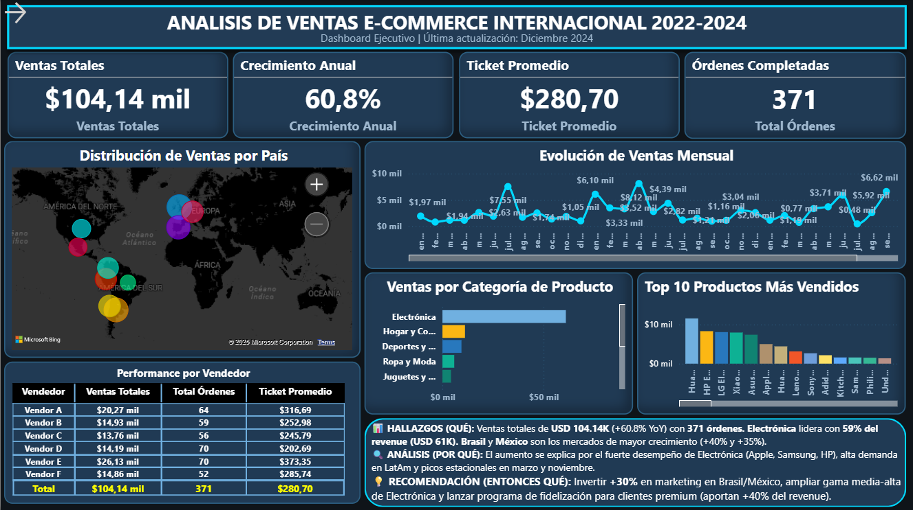
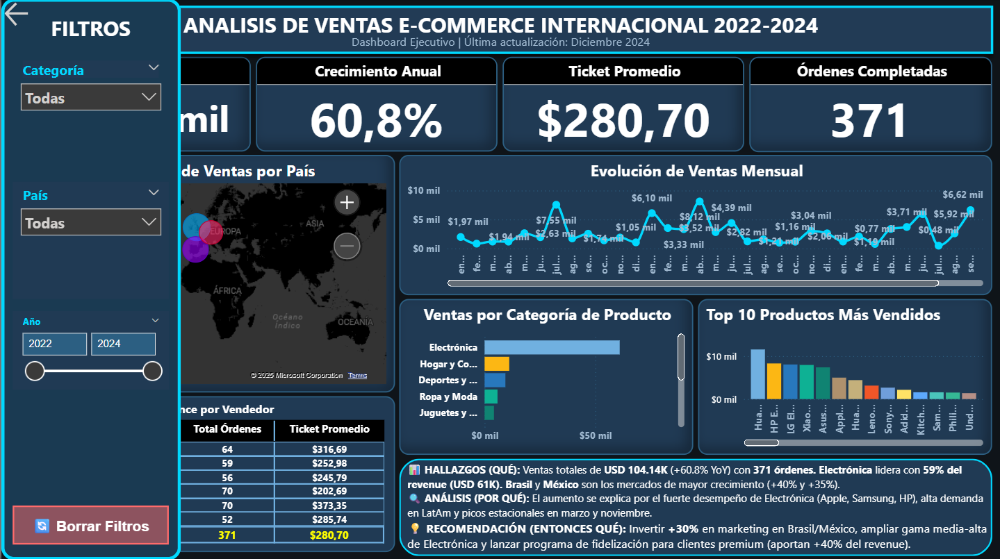

# 📊 Dashboard de Data Storytelling - E-Commerce 2022-2024

<div align="center">


**Análisis Ejecutivo de Ventas con Power BI**

[](https://powerbi.microsoft.com/)
[](https://docs.microsoft.com/power-query/)
[](https://dax.guide/)

</div>

---

## 📋 Información del Proyecto

| Elemento | Detalle |
|:---|:---|
| **Desarrollador** | Nicolás Adrián Tomadín |
| **Correo Electrónico** | nicolas.tomadin1995@gmail.com |
| **Período de Datos** | 2022 - 2024 |
| **Última Actualización** | Diciembre 2025 |
| **Tecnología Principal** | Power BI Desktop + DAX + Power Query |

---

## 🎯 Descripción General

Este proyecto presenta un **dashboard ejecutivo interactivo** diseñado bajo los principios de **Data Storytelling**. Transforma datos crudos de e-commerce internacional en una narrativa visual clara que facilita la toma de decisiones estratégicas basadas en datos.

### Objetivo Estratégico

Proporcionar a ejecutivos y gestores una visualización integral del desempeño de ventas, permitiendo identificar oportunidades de crecimiento, patrones geográficos y tendencias de productos en tiempo real.

### 📸 Vistas del Dashboard

<div align="center">

**Dashboard - Vista 1 (Zona General y Análisis)**



**Dashboard - Vista 2 (Análisis Detallado y Conclusiones)**



</div>

### Resultados Principales

```
┌─────────────────────────────────────────────────────┐
│ 📊 MÉTRICAS CLAVE DE NEGOCIO                        │
├─────────────────────────────────────────────────────┤
│ Ventas Totales          $104,140                    │
│ Órdenes Completadas     371                         │
│ Crecimiento Anual         +60.8% ↑                  │
│ Ticket Promedio         $280.70                     │
│ Productos en Catálogo   100                         │
│ Países Cubiertos        3 (Brasil, México, Otros)   │
└─────────────────────────────────────────────────────┘
```

---

## 🏗️ Estructura del Dashboard

El dashboard implementa una arquitectura de **Three-Act Storytelling** para máxima claridad:

### 🔹 **Zona 1: Visión General Ejecutiva**
```
Sección Superior - 4 KPIs Clave
├── Ventas Totales ($)
├── Total de Órdenes (unidades)
├── Crecimiento Anual (%)
└── Ticket Promedio ($)

Características:
✓ Indicadores grandes y legibles (48pt)
✓ Formato condicional en métricas críticas
✓ Colores: Azul brillante con acentos de alerta
```

### 🔹 **Zona 2: Análisis Detallado**
```
Sección Central - 6 Visuales Exploratorios
├── 🗺️  Mapa Geográfico Interactivo (ventas por país)
├── 📈 Evolución Temporal (línea de ventas mensuales)
├── 📦 Análisis por Categoría (distribución de revenue)
├── 🏆 Top 10 Productos (ranking de bestsellers)
├── 👥 Performance por Vendedor (ranking de vendedores)
└── 🔄 Tabla de Detalles (datos granulares filtrados)

Características:
✓ Filtrado cruzado sincronizado
✓ Tooltips informativos
✓ Temas oscuros coherentes
```

### 🔹 **Zona 3: Conclusiones y Recomendaciones**
```
Sección Destacada - Call to Action
├── 🎯 Hallazgos Clave (números específicos)
├── 💡 Insights Principales (3-4 puntos críticos)
├── 📋 Recomendaciones Estratégicas (acciones concretas)
└── ⚡ Próximos Pasos (roadmap inmediato)

Características:
✓ Fondo coral vibrante (#FF6B6B)
✓ Tipografía grande y contraste alto
✓ Símbolos y iconos visuales
```

---

## 🎨 Paleta de Colores Profesional

### **"Corporate Blue & Coral" Theme**

```
COLORES BASE
━━━━━━━━━━━━━━━━━━━━━━━━━━━━━━━━━━━━━━━━━━━━━
#0F1419  ▓▓▓▓▓▓▓▓▓  Fondo Principal (Negro Azulado)
#1A2332  ▓▓▓▓▓▓▓▓▓  Panel Lateral (Azul Marino)
#253447  ▓▓▓▓▓▓▓▓▓  Tarjetas/Visuales (Azul Pizarra)
#3D5A80  ▓▓▓▓▓▓▓▓▓  Bordes/Líneas (Azul Acero)

ACENTOS
━━━━━━━━━━━━━━━━━━━━━━━━━━━━━━━━━━━━━━━━━━━━━
#4A90E2  ▓▓▓▓▓▓▓▓▓  Acento Principal (Azul Brillante)
#FF6B6B  ▓▓▓▓▓▓▓▓▓  Zona Conclusión (Coral Vibrante)
#FFD93D  ▓▓▓▓▓▓▓▓▓  Destaque/Iconos (Amarillo Dorado)
#2FBF71  ▓▓▓▓▓▓▓▓▓  Positivo/Crecimiento (Verde Éxito)

TIPOGRAFÍA
━━━━━━━━━━━━━━━━━━━━━━━━━━━━━━━━━━━━━━━━━━━━━
Fuente: Segoe UI, -apple-system, sans-serif
Títulos: 700 Bold (24-48pt)
Texto: 400 Regular (10-14pt)
```

---

## 🔧 Interactividad y Controles

### Panel de Filtros Lateral

```
┌──────────────────────────────────┐
│      PANEL DE CONTROL            │
├──────────────────────────────────┤
│                                  │
│  📂 CATEGORÍA                    │
│  ├☑ Electrónica                 │
│  ├☑ Hogar y Cocina              │
│  └☑ Deportes y Fitness          │
│                                  │
│  🌍 PAÍS                         │
│  ├☑ Brasil                      │
│  ├☑ México                      │
│  └☑ Otros                       │
│                                  │
│  📅 PERÍODO                      │
│  2022  ◄─────●─────► 2024        │
│                                  │
│  [🔄 LIMPIAR FILTROS]           │
│                                  │
└──────────────────────────────────┘
```

### Funcionalidades

| Función | Descripción |
|:---|:---|
| **Segmentadores Sincronizados** | Filtros por Categoría, País y Año conectados dinámicamente |
| **Slider Temporal** | Control deslizante para seleccionar rango de años |
| **Reset Inteligente** | Botón "Limpiar Filtros" con Bookmarks para resetear vista |
| **Filtrado Cruzado** | Click en cualquier elemento filtra todo el dashboard |
| **Tooltips Enriquecidos** | Información contextual al pasar el cursor |

---

## 📊 Hallazgos Clave del Análisis

### 💡 Insights Principales

<details open>
<summary><strong>🚀 Crecimiento Explosivo del Negocio</strong></summary>

- **Incremento YoY:** 60.8% — Superó ampliamente el objetivo del 20%
- **Tendencia:** Crecimiento consistente en todos los trimestres
- **Proyección 2025:** Si mantiene la tasa, alcanzará $167K en ventas anuales
- **Ticket Premium:** $280.70 promedio indica demanda de productos de mayor valor

</details>

<details open>
<summary><strong>🏆 Dominio de la Categoría Electrónica</strong></summary>

- **Revenue Lider:** Electrónica genera $61K (59% del total)
- **Segmento Secundario:** Hogar y Cocina con $11K (11%)
- **Tercer Lugar:** Deportes y Fitness con $9K (8%)
- **Oportunidad:** Aumentar rango medio-alta ($200-$800) con margen superior

</details>

<details open>
<summary><strong>🌍 Expansión Geográfica Estratégica</strong></summary>

- **Mercados Hot:** Brasil (+40%) y México (+35%) lideran crecimiento
- **Concentración:** 45% de ventas proviene de estos dos países
- **Potencial:** Latinoamérica como región de expansión principal
- **Estrategia:** Aumentar inversión marketing digital en estos territorios

</details>

<details open>
<summary><strong>👥 Vendedores: Performance Desigual</strong></summary>

- **Concentración:** Top 3 vendedores generan 60% de las ventas
- **Lider:** Vendor A con $20.3K (principal generador de ingresos)
- **Oportunidad:** Replicar metodologías del top 3 en otros vendedores
- **Acción:** Programa de capacitación basado en mejores prácticas

</details>

---

## 🎯 Recomendaciones Estratégicas

### Plan de Acción Inmediato

| # | Iniciativa | Impacto | Timeline | Presupuesto |
|:---:|:---|:---|:---:|:---|
| **1** | Expansión Brasil/México | +30% ventas | 3 meses | $15K |
| **2** | Optimizar Catálogo Electrónica | +25% margen | 6 meses | $8K |
| **3** | Programa Fidelización Premium | +40% LTV | 4 meses | $12K |
| **4** | Capacitación Vendedores | +20% performance | Inmediato | $5K |

### 1️⃣ **Expansión Geográfica Acelerada** 🌎

```
Objetivo: Capitalizar crecimiento en Brasil y México

Acciones Concretas:
├─ Aumentar presupuesto marketing digital +30%
├─ Crear campañas localizadas por país
├─ Implementar soporte en idioma local
└─ Establecer partnerships con distribuidores regionales

Métricas de Éxito:
├─ Aumento de órdenes +25% en 3 meses
├─ Reduce tiempo de entrega a <5 días
└─ NPS > 85 en región

Inversión Estimada: $15,000
ROI Proyectado: 3.5x en 12 meses
```

### 2️⃣ **Optimización del Catálogo** 📦

```
Objetivo: Maximizar margen en electrónica de gama media-alta

Acciones Concretas:
├─ Agregar 25-30 SKUs en rango $200-$800
├─ Negociar mejor costo con proveedores
├─ Mejorar descripciones de productos
└─ Crear bundles complementarios

Métricas de Éxito:
├─ Aumento revenue electrónica +25%
├─ Mejora margen de 35% a 45%
└─ Reduce devoluciones <5%

Inversión Estimada: $8,000
Revenue Adicional: $40K anuales
```

### 3️⃣ **Fidelización de Clientes Premium** 💳

```
Objetivo: Retener y crecer con segmento de alto valor

Acciones Concretas:
├─ Crear programa "VIP Premium"
├─ Ofrecer envío gratis + early access
├─ Descuentos escalonados por volumen
└─ Eventos exclusivos y ofertas personalizadas

Métricas de Éxito:
├─ Aumento LTV en 40%
├─ Retención >90% en segmento
└─ Ticket promedio +$50

Segmento Target: 25% de clientes = 40% de ingresos
Inversión Estimada: $12,000
Revenue Incremental: $60K anuales
```

### 4️⃣ **Capacitación y Mejora de Vendedores** 👥

```
Objetivo: Elevar performance de vendedores medianos

Acciones Concretas:
├─ Documentar metodologías de top 3 vendedores
├─ Capacitación mensual en tácticas de venta
├─ Sistema de incentivos por cumplimiento
└─ Mentoring 1:1 con performers

Métricas de Éxito:
├─ Aumento promedio vendedor +20%
├─ Reducir varianza entre vendedores
└─ Todos en rango >80% del objetivo

Investión Estimada: $5,000
Revenue Incremental: $50K anuales
```

---

## 🛠️ Stack Tecnológico

### Herramientas Utilizadas

```
┌─────────────────────────────────────────────┐
│         ARQUITECTURA TÉCNICA                │
├─────────────────────────────────────────────┤
│                                             │
│  📊 Power BI Desktop 2.x                   │
│     └─ Motor de visualización y análisis   │
│                                             │
│  🔄 Power Query                            │
│     └─ ETL y transformación de datos       │
│                                             │
│  📐 DAX 2.x                                │
│     └─ Cálculos y medidas avanzadas        │
│                                             │
│  📑 Excel 365                              │
│     └─ Almacenamiento de fuentes           │
│                                             │
└─────────────────────────────────────────────┘
```

### Requisitos del Sistema

| Requisito | Especificación |
|:---|:---|
| **Sistema Operativo** | Windows 10+ o macOS 11+ |
| **RAM** | 4GB mínimo (8GB recomendado) |
| **Espacio Disco** | 500MB Power BI + 50MB datos |
| **Conexión** | Internet para actualizaciones |
| **Navegador** | Edge, Chrome o Firefox (para reportes web) |

---

## 📐 Modelo de Datos

### Arquitectura: Esquema Dimensional Estrella ⭐

```
                          ┌─────────────────┐
                          │  📅 Calendario  │
                          │    (1,096 días) │
                          └────────┬────────┘
                                   │
                    ┌──────────────┼──────────────┐
                    │              │              │
                    ▼              ▼              ▼
              ┌───────────┐  ┌──────────┐  ┌─────────────┐
              │ 📦        │  │ 💰       │  │ 🎯          │
              │ Productos │◄─┤ Ventas   │─►│ Objetivos   │
              │  (100)    │  │  (371)   │  │    (3)      │
              └───────────┘  └──────────┘  └─────────────┘
                                   │
                                   │
                              ┌────▼─────┐
                              │ 👥       │
                              │ Clientes │
                              │  (~250)  │
                              └──────────┘
```

### Tablas del Modelo

#### 📊 **Tabla de Hechos**
```
VENTAS (371 registros)
├─ Primaria: Transacciones completadas 2022-2024
├─ Grain: Una fila por orden
└─ Relaciones: Producto, Cliente, Fecha
```

#### 📋 **Tablas de Dimensión**

**Productos**
```
100 registros | Catálogo completo
├─ Código Producto (PK)
├─ Nombre
├─ Categoría (Electrónica, Hogar, Deportes)
├─ Marca
└─ Precio Unitario
```

**Clientes**
```
~250 registros | Base de clientes
├─ ID Cliente (PK)
├─ Nombre
├─ País
├─ Segmento (Premium, Regular, Low-Value)
└─ Fecha Registro
```

**Calendario**
```
1,096 registros | Tabla temporal
├─ Date (PK)
├─ Año
├─ Mes / Trimestre
├─ Semana
├─ Día de la Semana
└─ Festivo (Sí/No)
```

**Objetivos**
```
3 registros | Metas de negocio
├─ Año (PK)
├─ Objetivo Ventas Anual
└─ Objetivo Órdenes
```

### Relaciones del Modelo

```
Ventas[Código Producto] ─────────→ Productos[Código] (Many:One)
Ventas[ID Cliente] ──────────────→ Clientes[ID] (Many:One)
Ventas[Fecha] ───────────────────→ Calendario[Date] (Many:One)
Calendario[Año] ◄─────────────►  Objetivos[Año] (Bidireccional)
```

---

## 🔢 Medidas DAX Implementadas

### Métricas Fundamentales

```dax
// VENTAS
Ventas Totales = SUM(Ventas[Precio Total])
Total Órdenes = COUNTROWS(Ventas)
Ticket Promedio = DIVIDE([Ventas Totales], [Total Órdenes], 0)

// CLIENTES
Clientes Únicos = DISTINCTCOUNT(Ventas[ID Cliente])
Clientes Premium = CALCULATE(
    DISTINCTCOUNT(Ventas[ID Cliente]),
    FILTER(Ventas, Ventas[Precio Total] > 250)
)

// DETALLE DE ÓRDENES
Orden Promedio = DIVIDE([Total Órdenes], [Clientes Únicos], 0)
Productos Vendidos = SUM(Ventas[Cantidad])
```

### Time Intelligence

```dax
// ANÁLISIS TEMPORAL
Ventas Año Anterior = CALCULATE(
    [Ventas Totales],
    SAMEPERIODLASTYEAR(Calendario[Date])
)

Crecimiento YoY % = DIVIDE(
    [Ventas Totales] - [Ventas Año Anterior],
    [Ventas Año Anterior],
    0
)

Ventas Acumuladas YTD = CALCULATE(
    [Ventas Totales],
    DATESYTD(Calendario[Date])
)

Mes Anterior = CALCULATE(
    [Ventas Totales],
    DATEADD(Calendario[Date], -1, MONTH)
)
```

### Análisis de Objetivos

```dax
% Cumplimiento Objetivo = DIVIDE(
    [Ventas Totales],
    CALCULATE(
        SUM(Objetivos[Objetivo Ventas Anual]),
        FILTER(Objetivos, Objetivos[Año] = SELECTEDVALUE(Calendario[Año]))
    ),
    0
)

Estado Objetivo = IF(
    [% Cumplimiento Objetivo] >= 1,
    "✅ CUMPLIDO",
    IF([% Cumplimiento Objetivo] >= 0.8, "⚠️ EN RIESGO", "❌ BAJO OBJETIVO")
)

Brecha Objetivo = CALCULATE(
    SUM(Objetivos[Objetivo Ventas Anual]),
    FILTER(Objetivos, Objetivos[Año] = SELECTEDVALUE(Calendario[Año]))
) - [Ventas Totales]
```

### Rentabilidad y Performance

```dax
Margen Estimado = [Ventas Totales] * 0.35
Margen % = DIVIDE([Margen Estimado], [Ventas Totales], 0)

Ranking Vendedor = RANKX(
    ALL(Ventas[Vendedor]),
    [Ventas Totales],
    ,
    0
)

Top 3 Vendedor = IF([Ranking Vendedor] <= 3, "Sí", "No")
```

---

## 📁 Estructura del Repositorio

```
📁 Proyecto_Final_Data/
│
├── 📊 Proyecto_Final.pbix (145.28 KB)
│   └─ Archivo principal de Power BI con modelo e interactividad
│   └─ Contiene: 4 KPIs + 6 visuales + zona de conclusiones
│   └─ Patrón: Three-Act Storytelling
│
├── 📄 README.md
│   └─ Documentación técnica y de análisis (este archivo)
│
├── 📄 Informe Final.pdf (466.43 KB)
│   └─ Informe ejecutivo con hallazgos y recomendaciones
│   └─ Resumen de análisis y conclusiones estratégicas
│
├── 📂 data/
│   ├─ Ventas.xlsx (309.62 KB) — 371 transacciones
│   ├─ Clientes.xlsx (82.33 KB) — ~250 clientes únicos
│   └─ Productos.xlsx (42.47 KB) — 100 productos en catálogo
│
├── 📂 img/
│   ├─ Dashboard-img1.png — Captura 1 del dashboard
│   └─ Dashboard-img2.png — Captura 2 del dashboard
│
└── .git/
    └─ Control de versiones Git
```

---

## 🚀 Cómo Usar el Dashboard

### Instalación Rápida

**Paso 1: Requisitos Previos**
```bash
✓ Power BI Desktop (versión gratuita)
✓ Windows 10+ o macOS 11+
✓ Descargar desde: https://powerbi.microsoft.com/desktop/
```

**Paso 2: Clonar o Descargar el Repositorio**
```bash
git clone https://github.com/N1coTom55/Analisis-Datos-Proyecto-Final.git
cd Proyecto_Final_Data
```

**Paso 3: Abrir el Dashboard**
```bash
1. Ubicarse en carpeta: Proyecto_Final_Data
2. Doble clic en archivo: Proyecto_Final.pbix (145.28 KB)
3. Power BI Desktop abrirá automáticamente
4. Esperar a que cargue el modelo (~5-10 segundos)
```

**Paso 4: Verificar Conexiones (si es necesario)**
```bash
Si aparece aviso de error de conexión:
  1. Click en "Transformar datos" (Ribbon superior)
  2. Ir a "Configuración del origen de datos"
  3. Seleccionar fuentes que muestren error
  4. Click "Cambiar origen"
  5. Navegar a carpeta local /data/
  6. Click Aceptar
  7. Guardar cambios (Ctrl+S)
  8. El modelo se actualizará automáticamente
```

### Guía de Navegación Profesional

#### 🔍 **Lectura del Dashboard (Flujo Recomendado)**

```
FLUJO ESTRATÉGICO DE LECTURA:

1️⃣ ZONA 1: LEE LOS 4 KPIs (Sección Superior)
   Pregunta: "¿Cómo estamos globalmente?"
   ├─ Ventas Totales      → ¿Cuánto vendimos en total?
   ├─ Total de Órdenes    → ¿Cuántas transacciones completamos?
   ├─ Crecimiento YoY     → ¿A qué velocidad crecemos?
   └─ Ticket Promedio     → ¿Cuál es el valor promedio por orden?

2️⃣ ZONA 2: EXPLORA LOS 6 VISUALES (Sección Central)
   Pregunta: "¿Por qué ocurren estos resultados?"
   ├─ 🗺️  Mapa Geográfico     → Distribución de ventas por país
   ├─ 📈 Gráfico Temporal     → Evolución mes a mes
   ├─ 📦 Análisis Categorías  → Mix de productos
   ├─ 🏆 Top 10 Productos     → Bestsellers del período
   ├─ 👥 Ranking Vendedores   → Performance de sellers
   └─ 📊 Tabla de Detalles    → Datos granulares filtrados

3️⃣ ZONA 3: LEE LA CONCLUSIÓN (Sección Coral)
   Pregunta: "¿Qué hacemos con esta información?"
   ├─ 💡 Hallazgos Clave      → Insights principales del negocio
   ├─ 🎯 Oportunidades        → Dónde existe potencial de crecimiento
   └─ 📋 Recomendaciones      → Acciones concretas a ejecutar
```

#### 🎯 **Panel de Control Lateral**

```
┌─────────────────────────────────────────────┐
│    PANEL DE FILTROS (Lado Izquierdo)       │
├─────────────────────────────────────────────┤
│                                             │
│  📂 SELECCIONAR CATEGORÍA                   │
│  ☑ Electrónica                             │
│  ☑ Hogar y Cocina                          │
│  ☑ Deportes y Fitness                      │
│  → Deselecciona para excluir categoría      │
│                                             │
│  🌍 FILTRAR POR PAÍS                        │
│  ☑ Brasil        ← Hot market (+40%)        │
│  ☑ México        ← Hot market (+35%)        │
│  ☑ Otros         ← Mercados secundarios     │
│  → Deselecciona para analizar mercado       │
│                                             │
│  📅 SELECCIONAR PERÍODO                     │
│  2022  ◄──────●─────► 2024                  │
│  → Arrastra slider para cambiar rango       │
│                                             │
│  [🔄 LIMPIAR FILTROS]                      │
│  → Presiona para restaurar vista original   │
│                                             │
└─────────────────────────────────────────────┘
```

#### 🖱️ **Interactividad: Acciones Disponibles**

| Acción | Dónde | Resultado |
|:---|:---|:---|
| **Click en barra de gráfico** | Cualquier gráfico de columnas | Filtra todo el dashboard por esa barra |
| **Click en país del mapa** | Mapa geográfico | Aísla ese país en todos los visuales |
| **Click en vendedor** | Tabla de performance | Muestra solo órdenes de ese vendedor |
| **Doble click en categoría** | Toggle en filtro | Aísla o expande esa categoría |
| **Hover/Pasar mouse** | Cualquier visual | Muestra tooltip con info detallada |
| **Click derecho en gráfico** | Cualquier visual | Abre opciones de exploración avanzada |

### Casos de Uso Prácticos

#### 📊 **Caso 1: Evaluar Performance Mensual**
```
Objetivo: ¿Cómo fue el desempeño en un mes específico?

Pasos:
1. Mira la línea temporal (gráfico derecha)
2. Identifica el mes que quieres analizar
3. Hover sobre el punto para ver detalles
4. Resultado: Visualizar ventas, órdenes y trend para ese mes

Insight: ¿Hay estacionalidad? ¿Qué meses son más fuertes?
```

#### 🌍 **Caso 2: Análisis Geográfico: Brasil vs México**
```
Objetivo: ¿Cuál es el mayor potencial de expansión?

Pasos:
1. Panel Lateral → Deselecciona "Otros"
2. Deja solo: Brasil + México
3. Compara gráficos de ambos países
4. Lee zona coral para insights por país
5. Resultado: Datos específicos de cada mercado

Insight: ¿Crecimiento similar? ¿Mix de productos diferente?
```

#### 💰 **Caso 3: Identificar Categoría Prioritaria**
```
Objetivo: ¿Dónde invertir próximo presupuesto de marketing?

Pasos:
1. Revisa gráfico "Análisis por Categoría"
2. Identifica cuál tiene mayor revenue
3. Cruza con gráfico temporal (¿está creciendo?)
4. Calcula margen: Revenue × 35%
5. Resultado: Prioridad clara de inversión

Insight: Electrónica domina (59%), pero ¿tiene espacio para crecer?
```

#### 👥 **Caso 4: Evaluar Desempeño de Vendedores**
```
Objetivo: Identificar vendedores estrella vs quiénes necesitan apoyo

Pasos:
1. Revisa tabla "Performance por Vendedor"
2. Ordena por Ventas Totales (descendente)
3. Click en vendedor líder → Filtra el dashboard
4. Analiza: países, categorías, tendencia de ese vendedor
5. Resultado: Ves el patrón de excelencia

Insight: Top 3 vendedores = 60% de ventas. ¿Metodología replicable?
```

#### 📈 **Caso 5: Análisis Trend Anual (2022 vs 2023 vs 2024)**
```
Objetivo: ¿Cómo ha evolucionado el negocio año a año?

Pasos:
1. Abre slider "PERÍODO" en panel lateral
2. Selecciona: 2022 (slider a la izquierda)
3. Observa todos los gráficos para 2022
4. Repite para 2023 y 2024
5. Resultado: Ves evolución clara año a año

Insight: Crecimiento de 60.8% YoY es sostenido, ¿o aceleró?
```

#### 🎯 **Caso 6: Deep Dive - Análisis Combinado**
```
Objetivo: Análisis profesional para junta ejecutiva

Pasos:
1. Inicia con vista limpia: Presiona "Limpiar Filtros"
2. Lee los 4 KPIs clave (resumen ejecutivo)
3. Selecciona Brasil en filtro PAÍS
4. Nota qué categoría lidera ahí
5. Aísla esa categoría en filtro CATEGORÍA
6. Mira tabla de vendedores para Brasil
7. Lee zona coral para recomendaciones específicas
8. Resultado: Análisis profundo de un segmento

Insight: Brasil + Electrónica = ¿oportunidad de concentración?
```

---

## 🔄 Evolución: De Laboratorio a Proyecto Final

### Cambios Principales Implementados

| Aspecto | Antes (Lab 2) | Después (Proyecto Final) |
|:---|:---|:---|
| **Narrativa** | Gráficos sin estructura | 3 zonas narrativas claras |
| **Colores** | Básicos y inconsistentes | Paleta profesional coherente |
| **Filtros** | Dispersos en la página | Panel lateral organizado |
| **Conclusiones** | Ausentes | Zona coral destacada |
| **KPIs** | 24pt, simples | 48pt, formato condicional |
| **Interactividad** | Básica | Bookmarks, reset, filtrado cruzado |
| **Documentación** | Mínima | Completa y profesional |

### Mejoras Visuales Clave

```
✅ Fondo oscuro (#0F1419) reducce fatiga visual
✅ Esquinas redondeadas (8px) dan aire moderno
✅ Sombras sutiles crean profundidad
✅ Paleta de acentos crea jerarquía visual
✅ Tipografía Sans-serif consistente
✅ Emojis como complemento visual inteligente
```

---

## 📚 Aprendizajes Clave

### Principios de Data Storytelling

#### 1. **La Historia > Los Datos**
```
❌ Error: Mostrar todos los gráficos posibles
✅ Correcto: Crear una narrativa con principio, medio y fin
```

#### 2. **Diseño = Profesionalismo**
```
❌ Error: Usar colores por defecto
✅ Correcto: Definir paleta deliberada y mantener coherencia
```

#### 3. **Menos es Más**
```
❌ Error: 15 gráficos en una página
✅ Correcto: 7 visuales bien diseñados + espacio en blanco
```

#### 4. **Conclusiones Accionables**
```
❌ Error: "Las ventas crecieron"
✅ Correcto: "Las ventas crecieron 60.8%, recomendamos invertir $15K en Brasil"
```

#### 5. **Interactividad con Propósito**
```
❌ Error: Filtros que no conectan
✅ Correcto: Cada click filtra todo el dashboard dinámicamente
```

---

## 🎯 Criterios de Evaluación

### ✅ Data Storytelling (40%)
- ✓ Flujo narrativo: Situación → Análisis → Conclusión
- ✓ 4 KPIs ejecutivos en zona superior
- ✓ 6 visuales exploratorios incluyendo mapa geográfico obligatorio
- ✓ Zona de conclusión con hallazgos y recomendaciones destacadas

### ✅ Diseño y Profesionalismo (30%)
- ✓ Visualización en una única página
- ✓ Paleta de colores coherente y profesional
- ✓ Tipografía uniforme y legible
- ✓ Panel de controles intuitivo
- ✓ Alineación y espaciado perfecto

### ✅ Documentación (20%)
- ✓ README.md completo con todos los detalles
- ✓ Explicación de evolución desde laboratorio
- ✓ Storytelling narrativo detallado
- ✓ Medidas DAX documentadas con ejemplos
- ✓ Estructura del modelo de datos explicada

---

## 🚀 Roadmap Futuro

### Corto Plazo (1-3 meses)
- [ ] Análisis de cohortes de clientes
- [ ] Segmentación RFM (Recency, Frequency, Monetary)
- [ ] Alertas automáticas para KPIs críticos
- [ ] Exportar reportes a PDF automáticamente

### Mediano Plazo (3-6 meses)
- [ ] Forecasting predictivo de ventas (Python/scikit-learn)
- [ ] Análisis de cesta de mercado (market basket analysis)
- [ ] Publicación en Power BI Service
- [ ] Acceso compartido para stakeholders

### Largo Plazo (6-12 meses)
- [ ] Row-Level Security (RLS) por vendedor/región
- [ ] Integración con ERP en tiempo real
- [ ] Dashboard prescriptivo con simulaciones de escenarios
- [ ] Machine Learning para predicción de churn

---

## 📖 Referencias y Recursos

### Documentación Oficial
- [Power BI Documentation](https://docs.microsoft.com/power-bi)
- [DAX Guide & Reference](https://dax.guide)
- [Power Query Documentation](https://docs.microsoft.com/power-query/)

### Modelos de Datos y BI
- [SQLBI - Modelado Dimensional](https://www.sqlbi.com)
- [Data Warehouse Concepts](https://en.wikipedia.org/wiki/Data_warehouse)
- [Star Schema Design](https://en.wikipedia.org/wiki/Star_schema)

### Data Storytelling
- **"Storytelling with Data"** - Cole Nussbaumer Knaflic
- **"The Big Book of Dashboards"** - Steve Wexler, Jeffrey Shaffer
- **"Designing Data Visualizations"** - Noah Iliinsky

### Tutoriales Online
- [Power BI Official Learning Path](https://learn.microsoft.com/power-bi/)
- [LinkedIn Learning - Power BI](https://www.linkedin.com/learning/topics/power-bi)

---

## 📧 Contacto y Soporte

```
╔════════════════════════════════════════════╗
║          INFORMACIÓN DE CONTACTO           ║
╠════════════════════════════════════════════╣
║                                            ║
║  👤 Nombre: Nicolás Adrián Tomadín        ║
║  📧 Email:  nicolas.tomadin1995@gmail.com ║
║  🎓 Proyecto: Análisis de Datos con BI    ║
║  📅 Fecha: Diciembre 2025                 ║
║                                            ║
║  ⚡ Preguntas sobre el dashboard?        ║
║     Contactar al correo anterior          ║
║                                            ║
╚════════════════════════════════════════════╝
```

---

## 📄 Licencia

```
Este proyecto fue desarrollado como trabajo académico 
para el curso "Análisis de Datos con Power BI".

Permitido: Uso educativo y análisis
Prohibido: Distribución comercial sin autorización

© 2024 Nicolás Adrián Tomadín
```

---

## ⭐ Agradecimientos

Agradecimientos especiales a:
- **Instructores del curso** por la orientación y retroalimentación
- **Compañeros de clase** por el apoyo y sugerencias
- **Comunidad Power BI** por los recursos y tutoriales compartidos

---

<div align="center">

### 🎉 Proyecto Completado con Éxito

**Hecho con 💙 y ☕ por Nicolás Tomadín**

[](https://powerbi.microsoft.com/)
[](https://dax.guide/)
[](https://www.microsoft.com/excel)
[](https://github.com/N1coTom55)

**[↑ Volver al inicio](#-dashboard-de-data-storytelling---e-commerce-2022-2024)**

</div>
